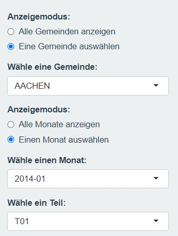
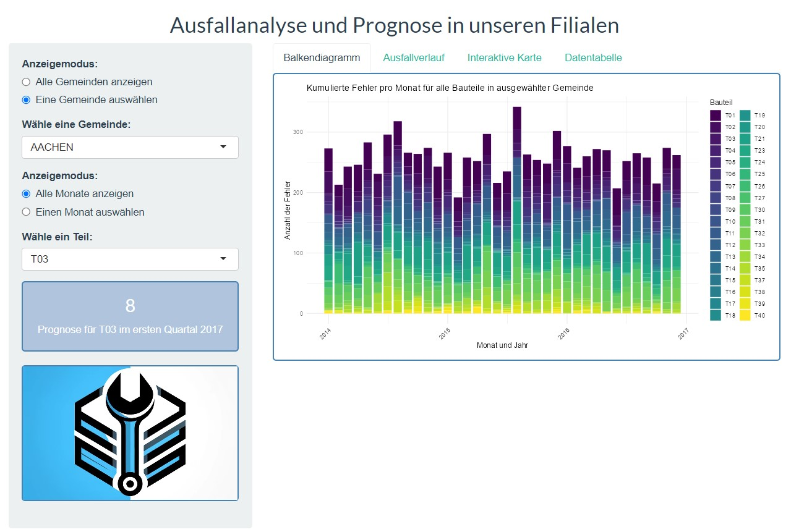
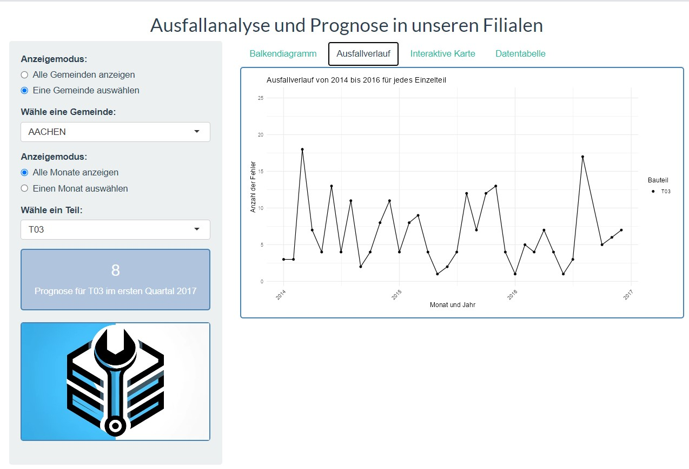
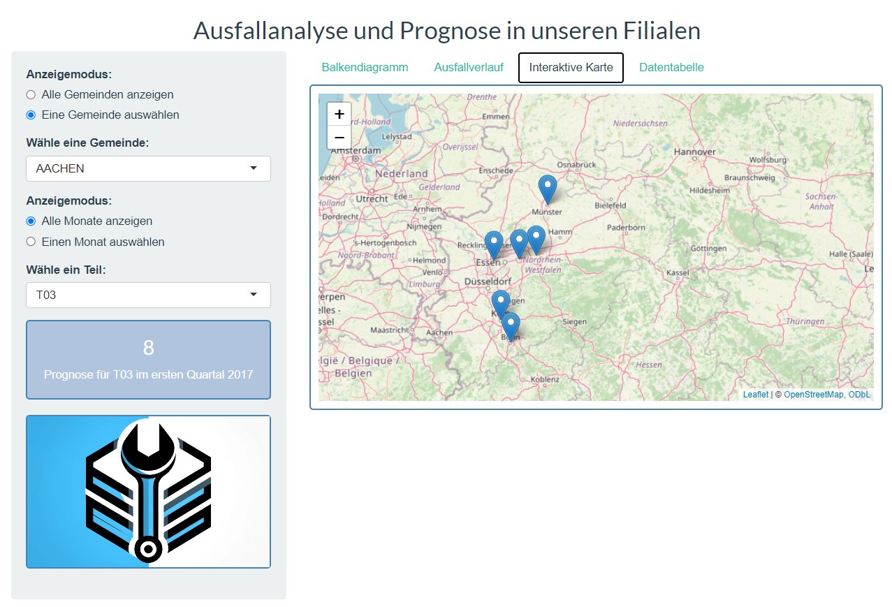

## Aufgabestellung

### Hintergrund
Die Autowerkstattskette in Nordrhein-Westfalen betreibt Werkstätten in Köln, Dortmund, Bielefeld, Bonn, Oberhausen, Bochum, Münster und Aachen. Das Management hat die Aufgabe an das Team delegiert, den Bedarf an Ersatzeinzelteilen für das kommende Kalenderjahr zu kalkulieren. Die Analyse basiert auf den Daten der letzten drei Jahre (2014 bis 2016), wobei davon ausgegangen wird, dass Fahrzeuge mit Fehlern in der Stadt repariert wurden, in der sie zugelassen sind.

### Aufgabenstellung
Ziel dieser Case Study ist die Analyse der historischen Daten der letzten drei Jahre (2014 bis 2016) und die Prognose des Bedarfs an Ersatzeinzelteilen für jede Werkstatt in den Städten Köln, Dortmund, Bielefeld, Bonn, Oberhausen, Bochum, Münster und Aachen.

## Library 

### Shiny-App Library

Für die Durchführung der folgenden datengestützten Analyse sind mehrere **R-Pakete** erforderlich. Insbesondere sind folgend diese Pakete benutzt:     

```{r, message=FALSE, warning = FALSE, cache = TRUE}

# Überprüfen, ob das Paket "install.load" verfügbar ist und wenn nicht, installieren
if(!require(install.load)){
  install.packages("install.load")
  library(install.load)
}

# Mit der install_load() Funktion werden die folgenden Pakete installiert und geladen:
install_load("dplyr",     # Datenmanipulation
            "readr",      # Einlesen von Daten
            "data.table", # Datenverarbeitung
            "shiny",      # Erstellung interaktiver Webanwendungen
            "tidyr",      # Datenbereinigung und -umstrukturierung
            "DT",         # Interaktive Tabellen
            "ggplot2",    # Erstellung von Grafiken
            "lubridate",  # Arbeit mit Datum und Uhrzeit
            "leaflet")    # Erstellung interaktiver Karten

# Die Argumente message = FALSE und warning = FALSE unterdrücken Nachrichten und Warnungen während der Installation und des Ladens von Paketen.
# Das Argument cache = TRUE aktiviert den Cache-Mechanismus, um bereits installierte Pakete nicht erneut zu installieren, es sei denn, es gibt eine neuere Version.

```

### Allgemeine Aufgaben Library

Hier ist die Library zu sehen, die für die Allgemeinen Aufgaben benutzt wurde:

```{r, message=FALSE, warning = FALSE, cache = TRUE}
# Überprüfen, ob das Paket "install.load" verfügbar ist und wenn nicht, installieren und laden
if(!require("install.load")){
  install.packages("install.load")
  library(install.load)
}

# Mit der install_load() Funktion werden die folgenden Pakete installiert und geladen:
install_load("readr",        # Einlesen von Daten
             "dplyr",        # Datenmanipulation
             "ggplot2",      # Erstellung von Grafiken
             "knitr",        # Erstellung von dynamischen Berichten
             "tidyverse",    # Sammlung von Paketen zur Datenmanipulation und -visualisierung
             "plotly",       # Interaktive Grafiken
             "moments")      # Statistische Momentberechnungen

# Die Argumente message = FALSE und warning = FALSE unterdrücken Nachrichten und Warnungen während der Installation und des Ladens von Paketen.
# Das Argument cache = TRUE aktiviert den Cache-Mechanismus, um bereits installierte Pakete nicht erneut zu installieren, es sei denn, es gibt eine neuere Version.

```

## Importieren der Daten
## Erstellen des finalen Datensatzes
## Auswertung

Um nun die finalen Daten auszuwerten, wurde eine Shiny-App erstellt. Ziel der App ist es eine übersichtliche Darstellung der Daten zu geben. 

### Implementierung Shiny-App

Der erste Schritt bei der Implementierung der Shiny-App sind zunächst die nötigen R-Pakete zu installieren. Hier sind es 'leaflet' und 'ggplot2'. Weiterhin wurde der ebenfalls noch der Datenanalyse zugrundeliegende finale Datensatz importiert.

#### User Interface




### App Features

#### Balkendiagramm 



Der erste Tab der Shiny-App zeigt eine Balkendiagramm, indem die kumulierten Fehler pro Monat für alle Bauteile in einer Gemeinde zu sehen sind. Die Standard-Anzeige zeigt zunächst die Fehler aller Bauteile für alle Gemeinden an. Diese ist zusätzlich auf beliebige Gemeinden anwendbar und wird über den Anzeigemodus auf der linken Seite gesteuert. Hierbei kann man über ein Dropdown-Menü die gewünschte Gemeinde auswählen. Weiterhin ist es möglich die Daten für einen gezielten Monat ausgeben zu lassen.

#### Ausfallverlauf



Der zweite Tab zeigt den Aufallverlauf für ein explizites Teil, welches ebenfalls über ein dropdown-Menü ausgesucht werden kann. Ebenfalls ist unter der Auswahloption des gewünschten Teils eine Prognose der Ausfälle für das erste Quartal im Jahr 2017 verzeichnet.

#### Karte 


Der dritte Tab zeigt eine interaktive Karte. Dort sind die Städte mit den Werkstätten markiert, diese Markierungen besitzen einen Pop-up, der die empfohlende Stückzahl für das Jahr 2017 zeigt.


#### Datentabelle


Der letzte Tab zeigt eine Tabelle, dieser enthält die für die Auswertung genutzten zugrundeliegende Datensatz. Der User kann hier ebenfalls mit der Search-Funktion nach Teilen oder Städten filtern.


## Ergebnis